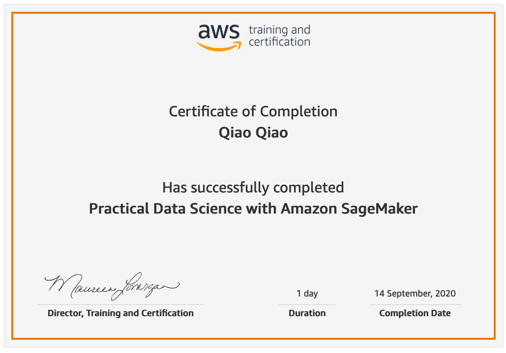

<h1 align="center"><b>Hi , I'm Qiao Qiao</b></h1>
<!-- -->

	

<!--
**qqiao2024/qqiao2024** is a ✨ _special_ ✨ repository because its `README.md` (this file) appears on your GitHub profile.

Here are some ideas to get you started:

- 🔭 I’m currently working on ...
- 🌱 I’m currently learning ...
- 👯 I’m looking to collaborate on ...
- 🤔 I’m looking for help with ...
- 💬 Ask me about ...
- 📫 How to reach me: ...
- 😄 Pronouns: ...
- ⚡ Fun fact: ...
-->

## 😄**About me**

 

- 🏫 A passionate Back-end developer
- 🤔 I’m currently open for a new job opportunity, this is [my linkedin](https://linkedin.com/in/qiaoqiao)
- 🧑‍💻 I love using Software as a solution for every Problem.
- 📝 I am currently learning `LLM` and `Langchain`.
- 🤓 Always learning new things.
  

  

## <b> Skills</b>
 

- **Languages**:
    
    
	
	
	

  

- **Back-End Development**:
  
	
	
	
	
	
	
	
	
	

  
    
- **Front-End Development**:

   
   
   
   

 

- **Cloud Hosting**:
  
	
    
    
 

- **Version Control**:

    
    
	

  

- **Softwares and Tools**:
  
	
    
	
	
	
	

 

- **CD/CI**:
  
  
  
  

  

- **Data Science**:
  
	
	

 

- **Databases**:
  
	
	
	
	
	

  

- **Operating Systems**:

     
	
	
	
	
	
	
	
	
	
	
	

 

- **Servers**:
  
	
	

- **Extras**:

	
	
	
	
	
    
      
	 
	
	
	

 
 

-----

 

## <b> Github Stats </b>
 

 
 
 

-----

 
 

## 📃<b> Certificates</b>

	

	

	

	

-----

## 🤝<b> Let's Connect..!</b>
 

 

 

	
</ul>

 

 
 
 

## <b>✨</b>

 
 
 
 

---

 

Credit: [Abdul Khalid](https://github.com/0xabdulkhalid)

Last Edited on: 09/09/2024